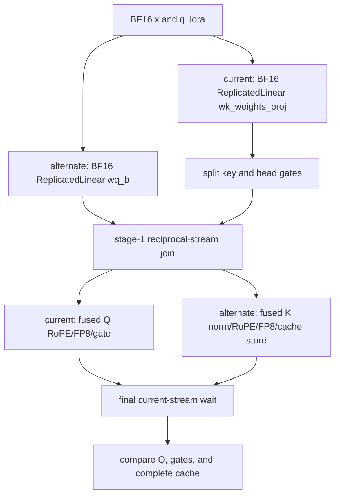

# Maintainer-style review of the final indexer experiment

## Comprehension

The fixed NVIDIA checkpoint reaches a BF16 `wq_b` and a fused BF16
`wk_weights_proj`. The stock method schedules wq on the alternate stream and wk
on the current stream, then Q on current and K/cache-store on alternate before
a final current-stream wait. Candidates in the corrected campaign change only
the wk backend or select the method's already-supported single-stream branch.

## Historical review synthesis

The SGLang human-review corpus sweep covered all 32,639 episodes in the
available June-2026 refresh. The exact DSA-indexer query matched 2 threads/2
PRs/3 comments; broader attention and stream/graph/performance/model sweeps
matched 1,565 threads across 792 PRs (6,003 comments). Recurring maintainer
requirements were exact checkpoint/config selection, dtype-specific evidence,
reproducible commands, quantified synchronization, graph-safe fallback, and
model/topology validation before promotion.

Those standards caused a material pre-finalization correction: the initial
campaign had assumed FP8 `indexer.wq_b` plus generic RoPE. Official pinned
config and safetensors evidence proves BF16 wq with max-position/base
1048576/8000000. The old region evidence is preserved but explicitly
superseded; all final performance conclusions use the source-hashed immutable
campaign.

## Findings

### Blocker: no reproducible performance win

- Direct ATen fused prepare/store paired medians are 1.003540x, 1.032630x, and
  1.002945x.
- Direct TGV medians are 0.564382x, 0.562612x, and 0.553539x.
- The exact stock-linear single-stream control is 1.012753x, 0.985414x, and
  0.978400x. All four captured kernels serialize on one stream.

None meets the shared requirement of stable >=1.03x repeated improvement.
Every row passed pre-timing and post-timing correctness, and the immutable
validator recomputed the raw paired ratios and source/JIT hashes.

### Blocker: containing/topology acceptance is unavailable

The measured workload ends at fused prepare/store and does not include
score/top-k or the selected DSA attention backend. The first all-GPU dummy run
used invalid TP4/DP1/EP1 topology and stopped during initialization. A corrected
TP4/DP4/EP4 allocation later failed closed before CUDA server launch on an
overly literal logical-versus-canonical venv-origin check; commit `95060f3`
fixes that check without relaxing repo-local provenance. A fresh corrected
retry made 180 locked wrapper attempts, all returned exit 75 under shared-host
contention, and never executed. Therefore no live TP4 routing or performance
claim is made. The production TP8/DP8/EP8 gate cannot run on this four-GPU
host and is not relabeled.

### Major: zero observed overlap does not justify single stream

Immutable stock Nsys launches four kernels and observes zero device-kernel
overlap inside the capture. Its CUDA-event time is 1.085568 ms versus
0.143616-0.175168 ms unprofiled, so absolute gaps and spans are too perturbed
for a production bottleneck claim. Under the same instrumentation, the exact
stock-linear single-stream control changes projected span 532.223 -> 501.918 us
and host range 1445.249 -> 1349.585 us. The serialized stream assignment is
real, but those sixfold-perturbed timings are not the promotion metric; the
three unprofiled schedule-only ratios reject the change.

The exact source dependency graph is two max-gated stages. Capture-local
durations put wq_b and Q on the longer branches (78.368 us combined), with wk
and K on the shorter branches. That is the
supportable critical-path statement; unprofiled launch overhead is not proven.

### Major: correctness scope must stay precise

Each immutable result compares reference/candidate before and after timing.
Fused-region post-checks rebuild all inputs from a fresh deterministic seed;
isolated projection post-checks reuse their deterministic inputs. Floating
region Q/gates use rtol/atol 2e-2; shape and dtype are exact. Reference caches use independent
`A5`/`5A` poison and candidates use `3C`/`C3`; the complete uint8 page-64 cache,
including scale bytes, is byte-exact. This gives both write-coverage and
post-timing mutation checks. It remains a synthetic rank-local reconstruction,
not live-checkpoint TP8 numerical validation.

### Warning: LoRA is not validated

The fixed recipe has LoRA disabled. Static inspection found a pre-existing
stale import of a removed module-global fusion flag in the LoRA manager. This
goal does not alter or silently validate that path; any LoRA deployment must
fix and test it separately.

## Recommendation

Do not promote a kernel, backend, or schedule from the validated rank-local
inner gate. Keep stock dual-stream SGLang as the unconditional fallback. A future attempt needs lower-overhead critical-path
evidence before choosing whole-region fusion or another device kernel, followed
by live fixed-checkpoint correctness, score/top-k + attention containment, and
TP8 end-to-end validation. The reverted K-before-Q source commit is historical
evidence only; its measurements used the superseded ABI and are not a production
performance claim.
