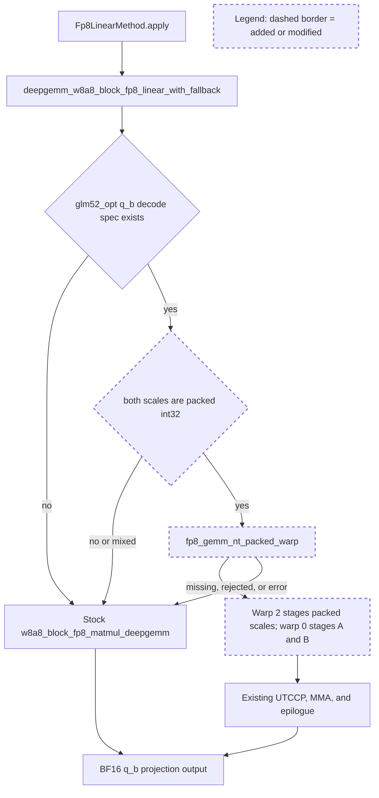

# SGLang maintainer-style review

## Comprehension

- The change adds an isolated DeepGEMM packed-UE8M0 entry for q_b decode.
- SGLang's existing GLM-5.2 dispatcher selects it only for a packed int32 pair.
- Any unavailable, mixed-ABI, rejected, or failing call returns to stock.
- The default serving-safe profile still has no implicit q_b replacement.

The runtime entry remains `Fp8LinearMethod.apply`. The existing stock wrapper
owns dynamic quantization and fallback. The changed branch accepts only the
production packed scale pair, calls the side-by-side overlay, and preserves the
stock output/stream contract. The new device branch changes scale staging only;
the tensor-core and epilogue pipelines are unchanged.

## Historical review synthesis

The exhaustive first sweep scanned 32,639 human-review threads and matched none
for the new goal-specific paths. A widened quantization/kernel/graph sweep
matched 1,897 threads across 773 PRs; a separate non-inline conversation sweep
matched 2,176 PR conversations. The recurring maintainer requirements were:

- prove a quantization branch is actually reachable and validate exact
  shape/dtype/backend conditions;
- avoid implicit format conversions or extra kernels in FP8 paths;
- preserve CUDA Graph compatibility and a safe fallback;
- provide reproducible hardware, launch command, correctness, and end-to-end
  performance evidence rather than an isolated benchmark;
- do not promote a kernel that only looks faster before graph capture.

Those concerns directly informed the runtime trace, packed-ABI guards,
fail-closed tests, graph replay, Nsys/NCU bundle, and stock-default decision.

## Findings

1. **Blocking promotion — graph/device performance regresses.**
   The candidate is slower in both CUDA-graph buckets and both final NCU
   reports. It must not become a production default. Resolution: no q_b bucket
   is promoted; `serving_safe` without an explicit q_b allowlist remains stock.

2. **External acceptance unavailable.**
   No local GLM-5.2 checkpoint exists and the host has four rather than eight
   B200s. This prevents full-decode/TP8 evidence. It does not alter finding 1
   and must not be replaced by a TP4 claim.

3. **Residual experimental API risk.**
   The device entry relies on SGLang's documented expansion of one weight scale
   across each 128-row block. Shape/stride checks alone cannot prove that an
   arbitrary external packed tensor has repeated values. Before exposing this
   entry beyond the q_b production trace, constrain the public API further or
   add adversarial scale-layout tests. The current default-off experimental use
   is appropriately scoped.

No additional correctness or graph-safety issue was found in the scoped q_b
path. Unit tests cover packed hit, unavailable overlay, mixed dtype, and thrown
error fallback; GPU evidence covers eager/graph correctness and selective M
fallback. The primary remaining risk is unsupported reuse of the specialized
entry, not the default stock serving path.

Corpus queries: exact touched paths plus `cuda graph`, `fp8`, `quantization`,
`fallback`, `benchmark`, `deepgemm`, `blackwell`, `packed`, `dtype`, and
`shape`; widened to quantization/layers/cuda-graph paths and then to
`pr_conversation`.
